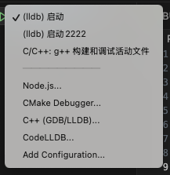
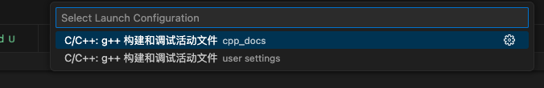

# c++ 笔记&例子


## 学习
环境 vscode + bazel + clang++ + macos

## debug方案

### 简单构建+调试调试
选择 C++(GDB/LLDB) 作为调试器




### g++ 自己编译 + lldb 调试


### bazel编译 + dsymutil 恢复+ lldb调试
https://blog.csdn.net/zhangpin04/article/details/104172999

以syntax/concept.cc 为例

先bazel编译
```
bazel build -c dbg --spawn_strategy=standalone //syntax:all
```
会生成可执行二进制文件，在bazel-bin/syntax目录下

然后恢复符号表
```
dsymutil bazel-bin/syntax/concept -o bazel-bin/syntax/concept.dYSM
```


最后用lldb插件调试，注意launch.json文件配置
```
{
    "name": "(lldb) 启动",
    "type": "cppdbg",
    "request": "launch",
    "program": "/Users/yjy/code/cpp_docs/bazel-bin/syntax/${fileBasenameNoExtension}", // 替换为你的可执行文件路径,.dYSM和可执行文件在同一个目录下
    "args": [],
    "stopAtEntry": false,
    "cwd": "/Users/yjy/code/cpp_docs/syntax", // 源代码的位置
    "environment": [],
    "externalConsole": false,
    "MIMode": "lldb"
},
```


# 学习资料

## B站视频
https://www.bilibili.com/video/BV1sBAkeZEpm/?spm_id_from=333.337.search-card.all.click&vd_source=b60fc618995711cd1e52528d93673559

